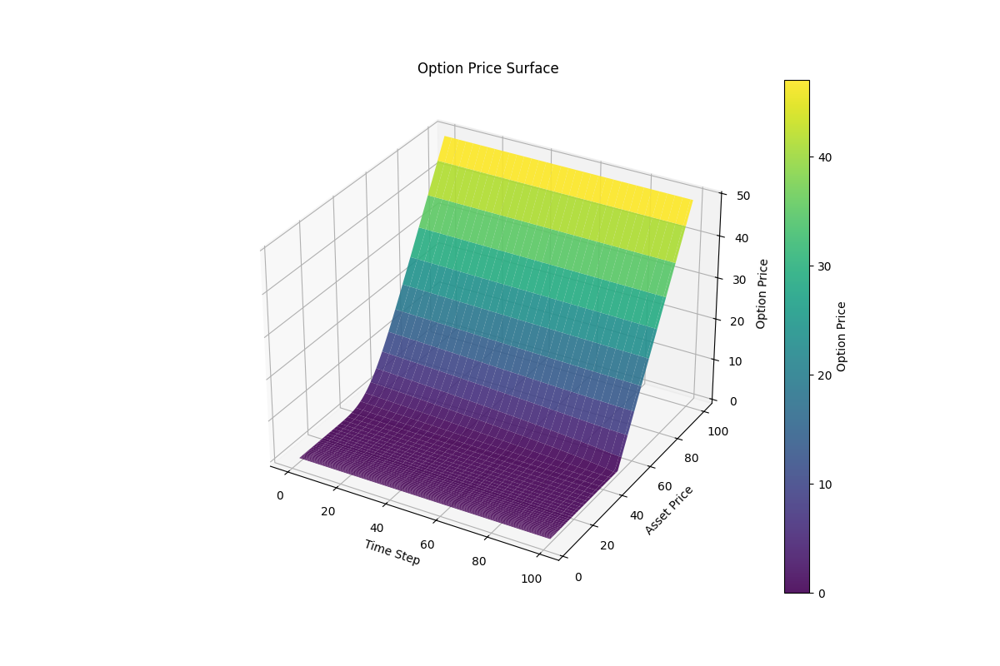

# Crank–Nicolson Option Pricing (C++)

This project implements a Crank–Nicolson finite-difference solver for European option pricing in C++ and writes surface and convergence output. A companion Python script (included) reads the generated CSV and renders a surface/heatmap.

Files
- `cranknicolson.cpp` — main implementation. Produces `convergence_crank.txt` and `surface_crank.csv` when run.
- `rawr.py` — Python script that reads `surface_crank.csv` and visualizes the option-price surface (heatmap / surface plot).

Quick overview
- The program computes the option price surface over time and asset-price grid using the Crank–Nicolson method.
- Output:
  - `convergence_crank.txt` — simple TXT with step counts and prices for convergence inspection.
  - `surface_crank.csv` — CSV with columns `TimeStep,AssetPrice,OptionPrice` suitable for plotting.

Requirements
- Microsoft Visual Studio (project provided for Visual Studio 2022/2026).
- A modern C++ compiler with C++11 (or newer) support.

Run (C++)
- Build the `cranknicolson` project in Visual Studio and run the executable. It will write the TXT, CSV files to the working directory.

Plot with Python (recommended)
- The included `plot_surface.py` reads `surface_crank.csv` and draws a surface/heatmap using `matplotlib`.
- Example:
  - `python rawr.py surface_crank.csv`
  - European Call with S0 = 50, K = 50, r = 0.06, dividends = 0.03, sigma = 0.2, T = 1.0

