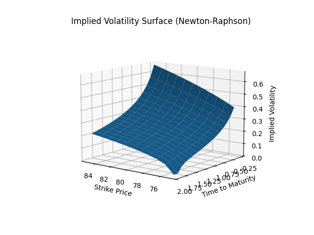
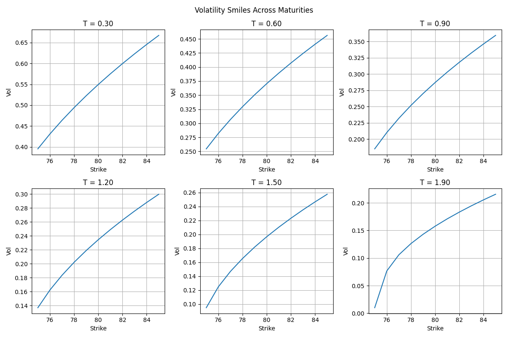
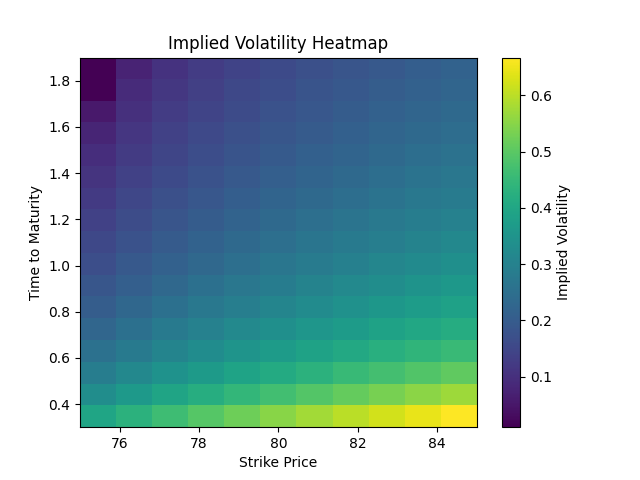

# Implied Volatility Surface (Newton-Raphson) & Visualization

## Overview

This project computes and visualizes a **volatility surface** for European call options using:

* **C++** → fast numerical computation
* **Newton-Raphson method** → efficient implied volatility solving
* **Python** → professional visualization

The result is a classic volatility surface:

```
(K, T) → σ
```

---

## Features

### C++ (Computation)

* Black-Scholes pricing (European call)
* Analytical **Vega** (required for Newton-Raphson)
* Fast root-finding using Boost:

  * `boost::math::tools::newton_raphson_iterate`
* Builds a **2D volatility surface**:

  * Strike price (K)
  * Time to maturity (T)
* Stores results in a `std::vector` matrix
* Exports results to CSV

---

### Python (Visualization)

* 3D volatility surface
* 2D volatility smile
* Heatmap (industry-standard view)
* Multi-panel smile plots across maturities

---

## Data Structure

Generated CSV file:

```
StrikePrice,Time,ImpliedVolatility
```

Each row represents:

```
(K, T) → σ
```

---

## How It Works

### 1. Black-Scholes Pricing

The European call option price is given by:

```
C = S * N(d1) - K * exp(-rT) * N(d2)
```

where:

```
d1 = [ln(S / K) + (r + 0.5 * σ^2) * T] / (σ * sqrt(T))
d2 = d1 - σ * sqrt(T)
```

* `N(x)` = cumulative distribution function of the standard normal distribution
* `S` = stock price
* `K` = strike price
* `r` = risk-free rate
* `T` = time to maturity
* `σ` = volatility

---

### 2. Vega (Derivative)

Vega measures sensitivity of price to volatility and is used in Newton-Raphson:

```
Vega = S * φ(d1) * sqrt(T)
```

---

### 3. Newton-Raphson Method

We solve for implied volatility by finding the root of:

```
f(σ) = BS(σ) - MarketPrice = 0
```

Iterative update:

```
σ_next = σ - f(σ) / f'(σ)
```

---

### 4. Surface Construction

The model evaluates implied volatility over a grid:

* Strike range: K ± range
* Time range: (0, T]

Result:

* A 2D grid (Strike × Time)
* Values = implied volatility

---

## Visualization

### 1. 3D Surface

* X → Strike
* Y → Time to maturity
* Z → Implied volatility



---

### 2. Multi-Panel Smiles

* Grid of smiles at different maturities
* Shows term structure evolution



---

### 3. Heatmap

* X → Strike
* Y → Time
* Color → Volatility



---

## How to Compile (C++)

Requires Boost library.

```bash
g++ -std=c++17 -O2 main.cpp -o vol_surface -lboost_math_c99
./vol_surface
```

This generates:

```
implied_vol_surface.csv
```

---

## How to Run (Python)

### Install dependencies

```bash
pip install pandas numpy matplotlib plotly
```

### Run visualization

```bash
python plot_surface.py
```

---

## Notes

* Newton-Raphson is:

  * Fast and efficient
  * May fail if Vega is very small or initial guess is poor
* Errors are handled by:

  * Catching exceptions
  * Writing `NaN` values
* Missing values may appear in:

  * Deep ITM/OTM regions
  * Very short maturities

